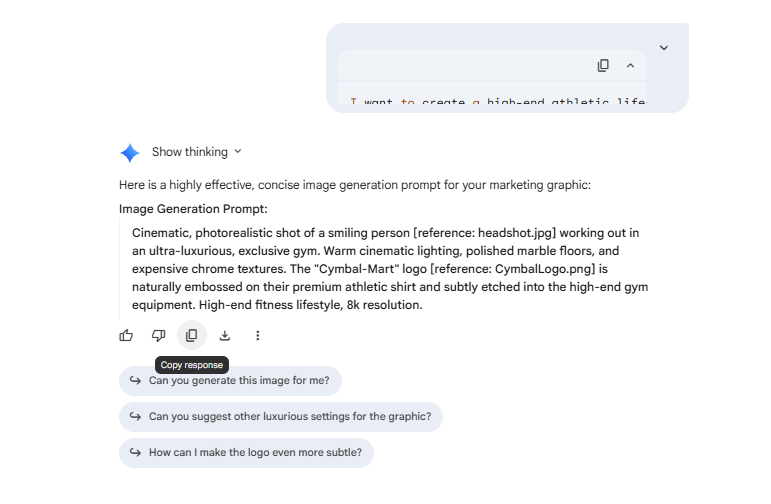

# Meta Prompting for Image Generation

## Time Required
20–30 minutes

## Overview
In this lab, you will use a **meta-prompt** — asking Gemini to write an image generation prompt for you — and then use that AI-generated prompt to produce the actual image. This technique is especially useful for complex, high-production-value assets where precise prompt structure matters but the technical vocabulary of image generation is unfamiliar.

### You learn how to:
- Use a meta-prompt to transform a plain-language brief into a structured, technical image generation prompt.
- Evaluate and refine an AI-generated prompt before using it.
- Apply meta-prompting to retail and marketing use cases.

## Scenario

<p align="left">
  
</p>

Cymbal-Mart is launching a premium athletic apparel line. The Marketing team wants a **luxury lifestyle photograph** featuring the new line in an exclusive gym setting, with the Cymbal-Mart logo integrated naturally into the environment. Rather than writing a long technical prompt from scratch, you will ask Gemini to write the prompt for you — then use it.

## Lab Instructions

### Task 1: Generate a Prompt with a Meta-Prompt

A meta-prompt asks Gemini to generate a prompt for another task — in this case, an image generation prompt. This is a powerful technique when you know what you want visually but don't know the exact language that produces it.

1. Open **Gemini Enterprise** in your browser.

2. Copy and paste the following meta-prompt into the chat, then press **Enter**:

   ```text
   I want to create a high-end athletic lifestyle marketing image for Cymbal-Mart that feels luxurious and aspirational. Please write a precisely engineered image generation prompt for me.

   The scene should feature a person happily working out (I will provide a headshot) with the Cymbal-Mart logo integrated naturally into the environment — not just placed on top. Focus on expensive textures, cinematic lighting, and a sophisticated athletic setting like an exclusive gym. The logo should appear as a realistic branded detail on equipment, apparel, or architecture. Write the prompt so it can be used directly in an image generation tool.
   ```

3. Review the generated prompt. Note how Gemini structures it differently from your original request — more specific technical language, explicit attention to lighting, texture, and perspective.

4. Click the **Copy response** icon to copy the generated prompt.

   <p align="left">
     
     <br><em>Copy the generated prompt to use in a new chat</em>
   </p>

   > [!NOTE]
   > If you'd like to skip ahead or compare results, here is an example of a prompt this technique produces:
   >
   > ```text
   > Cinematic, photorealistic shot of a person [insert headshot.jpg] happily exercising in an ultra-exclusive luxury gym. The environment features expensive textures: dark oak paneling, polished marble floors, and matte black steel equipment. Illuminated by soft, golden cinematic lighting from large arched windows. The Cymbal-Mart logo [insert CymbalLogo.png] is naturally embossed on the weight plates and subtly etched into a frosted glass wall behind them. The subject wears high-end athletic apparel with the Cymbal-Mart wordmark on the chest. 8K resolution, highly detailed, shallow depth of field.
   > ```

### Task 2: Use the Generated Prompt to Create the Image

1. Click **New chat** to open a fresh session.

2. In the chat bar, select the **Tools** icon and choose **Generate images**.

3. Click **+ Add files** → **Upload files**. In the dialog, select `headshot.jpg` and `cynbal-mart-logo.png`, then click **Open**.

4. Paste the prompt you copied from Task 1 into the chat. If the prompt references placeholder text like `[insert headshot.jpg]`, replace those references with natural language: `"using the uploaded headshot for the person's face"` and `"using the uploaded CymbalLogo.png for the logo."`

5. Press **Enter** and review the result.

### Task 3: Evaluate the Meta-Prompt Technique

1. Compare the image you just generated with the images from Labs 1 and 2. In those labs you wrote the prompts yourself; here Gemini wrote it for you. What differences do you notice in the structure and specificity of the prompts?

2. Try using the meta-prompt technique for a second use case. Ask Gemini to write an image generation prompt for a different Cymbal-Mart marketing scenario — for example:

   ```text
   Write an image generation prompt for a high-quality product photography shot of a Cymbal-Mart end-cap display. The display should feature a seasonal promotion (e.g., summer outdoor living). Focus on in-store retail photography conventions: clean product arrangement, warm lighting, visible price tags, and natural customer interaction in the background.
   ```

3. Generate the image with the produced prompt. Share both the meta-prompt output and the resulting image with the group.

## Congratulations

In this lab, you have:
- Used a meta-prompt to generate a structured, technical image generation prompt from a plain-language brief.
- Applied the generated prompt to produce a luxury lifestyle marketing asset.
- Explored how Gemini translates high-level creative intent into precise visual language.
