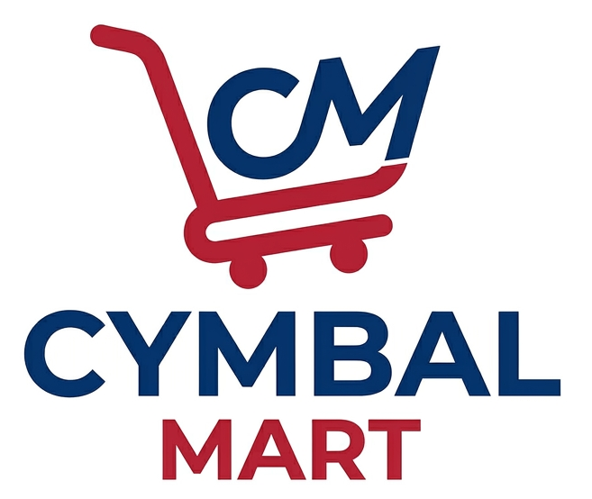

# Video Analysis

## Time Required
20–30 minutes

## Overview
In this lab, you will upload a store walk-through video alongside a PDF standards document and ask Gemini to cross-reference them — identifying compliance violations, citing specific policy sections, and providing exact timestamps. This is a practical example of multimodal analysis: Gemini reads the document and watches the video simultaneously to produce a grounded, timestamped audit.

### You learn how to:
- Upload and analyze a video file with Gemini.
- Provide a reference document as grounding context for video analysis.
- Ask Gemini to produce structured, cited outputs from unstructured video data.

## Scenario

<p align="left">
  
</p>

Cymbal-Mart's Loss Prevention and Store Operations team conducts quarterly compliance audits across its retail locations. A regional manager has submitted a walk-through video from Store #114 for review. You need to cross-reference the footage against the company's official **Visual Merchandising and Store Standards** document and produce a formal audit report before the next leadership review.

## Before You Begin

You will need two files for this lab:
- `store.mp4` — a walk-through video of a Cymbal-Mart store aisle or storefront
- `Cymbal-Mart_VisualMerchandising_and_Store_Standards.pdf` — the standards document

Both files are available in the `data/` folder of this course.

## Lab Instructions

### Task 1: Upload the Files and Run the Audit

1. Open **Gemini Enterprise** in your browser.

2. Click **+ Add files** → **Upload files**. In the dialog, select both `store.mp4` and `Cymbal-Mart_VisualMerchandising_and_Store_Standards.pdf`, then click **Open**.

3. Copy and paste the following prompt into the chat, then press **Enter**:

   ```text
   Role: You are the Primary Safety and Compliance Manager for Cymbal-Mart, conducting a formal virtual audit of Store #114.

   Task: Analyze the provided store walk-through video. Identify every instance of non-compliance with the "Cymbal-Mart Visual Merchandising and Store Standards" document.

   Instructions:
   - Cross-reference: For every violation identified, cite the specific section of the Standards document (e.g., "Violation of Section 3.2: Vertical Stacking").
   - Evidence: Provide the exact timestamp from the video where each violation occurs.

   Output format:
   1. Audit Log — a chronological list of violations, each with: [Timestamp] | [Violation Category] | [Description of Hazard] | [Standards Section]
   2. Critical Risk Summary — the top 3 most serious hazards requiring immediate intervention, with a brief explanation of why each is high-priority.
   3. Operational Recommendations — brief, actionable suggestions for the Store Manager to prevent recurrence of each violation type.
   ```

4. Review the output. Verify that each cited standards section actually corresponds to the violation described — this is a good way to test the grounding quality of the analysis.

### Task 2: Drill Down on a Specific Violation

1. Pick one violation from the Audit Log that interests you. Ask a follow-up question to get more detail:

   ```text
   For the violation at [timestamp], what specific corrective action should the store associate take, and how long should it realistically take to fix?
   ```

2. Ask Gemini to reprioritize the findings by a different criterion:

   ```text
   Re-rank all the violations by estimated customer safety risk rather than chronological order. Which three are most likely to cause a customer injury if not addressed today?
   ```

### Bonus Task 3: Write the Manager's Corrective Action Email

1. Ask Gemini to draft a formal corrective action email:

   ```text
   Draft a formal corrective action email from the Regional Manager to Store #114's General Manager. The email should reference the top 3 critical findings from the audit, set a 48-hour remediation deadline for each, and request photographic confirmation of completion.
   ```

2. Review the draft. Would you send it as-is, or does it need edits? What information from the audit report is missing or could be added to make the email more useful?

## Congratulations

In this lab, you have:
- Uploaded a video and a PDF document for simultaneous multimodal analysis.
- Generated a timestamped, citation-grounded compliance audit from unstructured video footage.
- Used follow-up prompts to drill down into specific findings and generate actionable communications.
