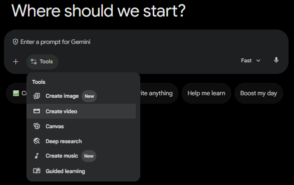

# A Happy Family Shopping Trip

## Overview
This play teaches you how to generate a high-fidelity marketing video and engineer a synchronized 10-second audio script. You will start with a basic video prompt, build a timing-aware script, and then produce an advanced version that aligns voiceover pacing with cinematic visuals.

### Objectives
In this play, you learn how to:
- Generate a baseline 10-second branded video from a simple prompt.
- Create and refine a production-ready audio script with second-by-second timing.
- Combine visual direction and audio timing into a stronger final prompt.
- Compare output quality between a basic and advanced generation workflow.


## Instructions

### Part 1: Generate a Baseline Video
Goal: Create a first-pass holiday ad quickly to establish a baseline.

1. Open Gemini in your browser.

   Note: Make sure you are using Gemini, not Gemini Enterprise.

2. In the chat bar, select the Tools icon and then choose Create video.



3. Select + Add files and choose Upload files. If prompted, press Agree.

4. In the dialog, select CymbalLogo.png and click Open.

5. In the chat, copy and paste the following prompt, then press ENTER.

```
Create a 10-second holiday social media ad for Cymbal-Mart.
Scene: A happy family shopping in a modern store decorated for the holidays.
Branding: Use [CymbalLogo.png] naturally on shopping bags and digital screens in the store.
Style: Bright, festive, modern, and energetic.
Camera: Smooth movement with a mix of wide and close-up shots.
Color Direction: Emphasize blue and silver accents.
```

6. Let the video generate and review the output.

7. Reflection check (quick notes):
- What worked visually?
- What felt generic or unclear?
- Where did pacing or story flow feel weak?

---

### Part 2: Engineer a 10-Second Audio Script
Goal: Build a voiceover script that matches the intended visual rhythm.

1. Click `New chat` to start a fresh session.

2. In the chat, copy and paste the following prompt, then press ENTER.

```
You are a senior advertising copywriter for Cymbal-Mart.
Write a 10-second holiday voiceover for a social media ad featuring a family shopping in-store.

Requirements:
- Tone: Smart, festive, and tech-forward.
- Mention Cymbal-Mart by name.
- Keep language simple, warm, and energetic.
- Include a clear call to action in the final line.

Output format:
1) Final voiceover script (single read, max 28 words).
2) Second-by-second timing map from 0s to 10s showing which words/phrases should be spoken.
3) One alternate version with slightly faster pacing.
```

3. Read the script out loud once to validate timing.

4. If needed, ask Gemini to tighten the script to fit 10 seconds naturally.

5. You can save your generated script in a document for use in Part 3, or you can copy our generated script below.

```
1) Final Voiceover Script"The brightest gifts, the smartest tech, and more time for what matters. Find your family’s holiday magic at Cymbal-Mart. Shop the season’s best deals in-store today!"(27 words)

2) Second-by-Second Timing MapTimePhrase / Words:
0s – 2s "The brightest gifts, the smartest tech
2s – 4s "and more time for what matters."
4s – 7s "Find your family’s holiday magic at Cymbal-Mart."
7s – 10s "Shop the season’s best deals in-store today!"
```

6. Take a moment to do a sanity check:
- Does it sound natural at speaking speed?
- Is the brand message clear?
- Does the ending call to action land in the final second?

---

### Part 3: Generate an Advanced Video with Script Alignment
Goal: Produce a higher-quality final ad by combining cinematic direction with voiceover timing.

1. Click `New chat` to start a fresh session.

2. In the chat bar, select the Tools icon and choose Create video.

3. Select + Add files and choose Upload files.

4. In the dialog, select CymbalLogo.png and click Open.

5. In the chat, copy and paste the prompt given below, then press ENTER.

	Note: Feel free to replace our voiceover script with the one you generated in Part 2.

```
Task: Generate a 10-second premium holiday video ad for Cymbal-Mart.

Strict Audio Requirement: You MUST use the following voiceover script verbatim. Do not paraphrase, shorten, or extend it.

Script: "The brightest gifts, the smartest tech, and more time for what matters. Find your family’s holiday magic at Cymbal-Mart. Shop the season’s best deals in-store today!"

Technical Synchronization Map:
0s–2s: [Visual: Wide shot of a family walking into a festive Cymbal-Mart] Audio: "The brightest gifts, the smartest tech"
2s–4s: [Visual: Medium shot of the family laughing over a gadget] Audio: "and more time for what matters."
4s–7s: [Visual: Aisle shot with [CymbalLogo.png] on signage; warm holiday lighting] Audio: "Find your family’s holiday magic at Cymbal-Mart."
7s–10s: [Visual: Close-up of shopping bags with [CymbalLogo.png] at checkout] Audio: "Shop the season’s best deals in-store today!"

Visual Direction:
Cinematic Style: Warm, high-end holiday lighting, realistic reflections, and blue/silver brand accents.
Branding: Overlay [CymbalLogo.png] naturally on physical assets within the store and end on a high-contrast brand close.

Output: One 10-second video with the audio perfectly synced to the timing map above.
```

6. Review your final output and compare it to Part 1.

7. Save the final video for sharing.
---
