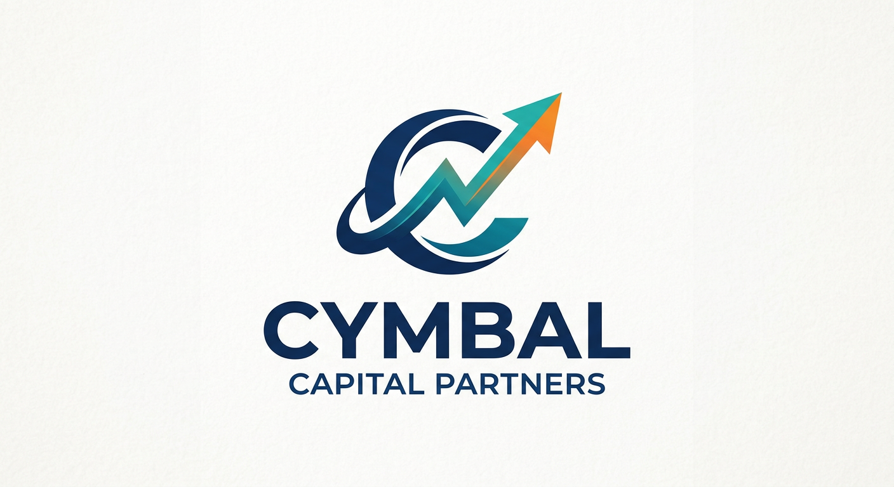

# Ice Breaker: Put Yourself in Cymbal Capital Partners

## Time Required
10–15 minutes

## Overview
In this lab, you will use Gemini's image generation model to place yourself — using your own headshot — into a Cymbal Capital Partners investment setting. This is a quick, fun introduction to Gemini's multimodal image generation capabilities and a great way to kick off the course.

### You learn how to:
- Upload an image file as context for an image generation prompt.
- Use a detailed, role-based prompt to control setting, branding, and style.
- Generate a professional, context-aware image asset.

## Scenario

<p align="left">
  
</p>

Cymbal Capital Partners is running an internal leadership spotlight campaign. The Brand and Communications team wants a series of polished, credible portraits placing team members inside the firm's offices and deal-making environments. You have been asked to generate your own spotlight photo.

## Lab Instructions

### Task 1: Generate Your Finance Portrait

1. Open Gemini Enterprise in your browser.

2. In the chat bar, select the **Tools** icon and choose **Generate images**.

3. Click **+ Add files** and select **Upload files**. In the dialog, select your `headshot.jpg` and click **Open**.

4. Copy and paste the following prompt into the chat, then press **Enter**:

```text
    You are a professional photographer taking a polished and authentic portrait for an executive spotlight series. Using the face from the uploaded headshot, maintaining the facial identity as a perfect, unaltered match, place it onto the body of a finance professional.

  The professional is wearing a tailored charcoal suit, crisp white shirt, and a deep blue tie with a subtle Cymbal Capital Partners logo pin on the lapel. Their expression is confident, thoughtful, and approachable, holding a tablet in one hand and reviewing a printed pitch deck with the other.

  The setting is the interior of a modern Cymbal Capital Partners office. The background shows floor-to-ceiling glass walls, a sleek boardroom table, city skyline views, framed investment theses, and a subtle wall display labeled with phrases like "Portfolio Strategy" and "Growth Capital." In the distance, colleagues collaborate around a conference screen showing market charts and deal flow summaries. The lighting is clean and premium, mixing soft natural window light with warm overhead accents. The photo is taken at eye level, capturing the energy and sophistication of the firm. The feel is ambitious, analytical, and high-trust — sharp and detailed, like a premium editorial portrait.
```

5. Review the result. If the likeness or setting is not quite right, see the Bonus Task below for refinement techniques.

### Bonus Task 2: Refine and Experiment

1. Try swapping the setting. Ask Gemini to regenerate the same portrait but place you **in a private investment meeting room** instead of the office — surrounded by notebooks, cap tables, financial models, and subtle branded signage.

2. Experiment with one change at a time: adjust the lighting description, change the uniform, or modify the expression instruction. Notice how each specific change affects the output.

3. Share your best result with the group.

## Congratulations

In this lab, you have:
- Uploaded a personal image as generation context.
- Used a detailed, structured prompt to control identity, setting, and style.
- Generated a finance-themed executive spotlight image using Gemini.
