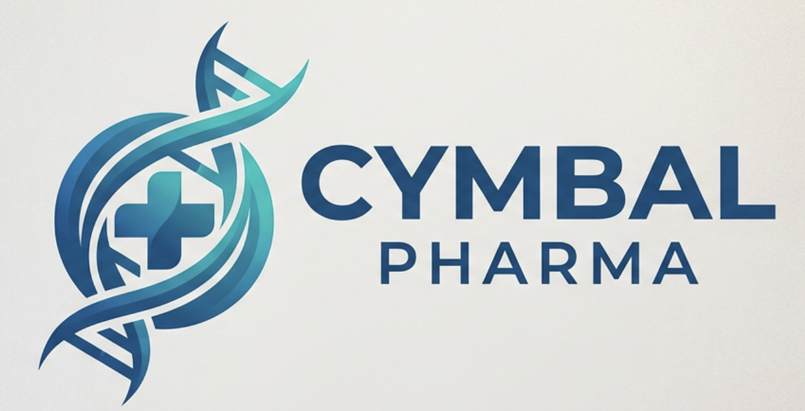
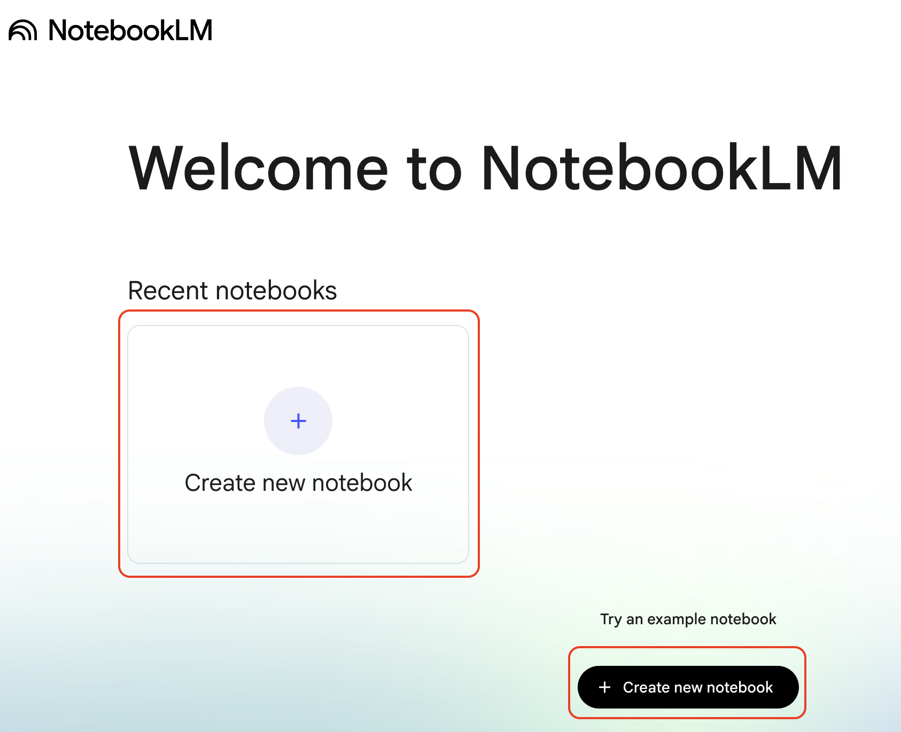

# Getting Started with NotebookLM

## Time Required
20–30 minutes

## Overview
In this lab, you will create your first NotebookLM notebook and explore its core features: uploading a source document, reviewing the automatically generated Notebook Guide, and asking targeted questions that are grounded in your source. Every answer NotebookLM provides includes a citation that links directly back to the relevant passage — so you can verify every claim in seconds.

### You learn how to:
- Create a new notebook in NotebookLM.
- Upload a PDF as a source document.
- Use the Notebook Guide to get an instant structured overview of a complex document.
- Ask targeted questions and follow up on specific citations.
- Add a note to capture your own analysis alongside the AI-generated content.

## Scenario

<p align="left">
  
</p>

Dr. Aris Thorne is a Senior Research Scientist in Cymbal Pharma's Early-Stage Drug Discovery unit. His team has been fast-tracking a promising new Alzheimer's compound called **CPH-412**.

A critical, 30-page *Initial Safety and Toxicity Report* has just arrived from the lab. Aris has exactly one hour before a stakeholder meeting where he must identify the high-risk data points and recommend a path forward. Reading the full report in 60 minutes would leave no time for preparation — but with the right tool, it doesn't have to.

In this lab, you (acting as Dr. Thorne) will use NotebookLM as a triage tool: uploading the report, getting an instant overview, and extracting the exact findings that matter before the meeting starts.

## Before You Begin

The toxicity report for this lab is included in this lab's folder:

**`Preliminary Safety and Toxicity Evaluation of Compound CPH-412.pdf`**

You will upload this file directly to NotebookLM in Task 1. Locate it in the lab folder before continuing.

## Lab Instructions

### Task 1: Create a Notebook and Upload the Report

1. Open [NotebookLM](https://notebooklm.google.com/) in your browser. Sign in with your Google account if prompted.

2. On the NotebookLM home page, click **New notebook**.

   <p align="left">
     
     <br><em>The New notebook button on the NotebookLM home page</em>
   </p>

3. A new, empty notebook opens. You will see the **Sources** panel on the left and the chat interface in the center.

4. In the **Sources** panel, click **+ Add sources**.

   <p align="left">
     
     <br><em>The Sources panel in an empty notebook</em>
   </p>

5. In the source picker, select **Upload** and upload `Preliminary Safety and Toxicity Evaluation of Compound CPH-412.pdf` from this lab's folder.

6. Wait a few seconds while NotebookLM processes the document. The source appears in the Sources panel when it is ready.

   > [!NOTE]
   > NotebookLM reads and indexes the full document during this step. The richer and more structured the source, the better the quality of answers and citations you will receive.

### Task 2: Explore the Notebook Guide

Once a source is added, NotebookLM automatically generates a **Notebook Guide** — a structured overview of the document's key topics, themes, and suggested questions.

1. In the chat panel, click **Notebook Guide**.

   <p align="left">
     
     <br><em>The Notebook Guide provides an instant overview of your source</em>
   </p>

2. Read through the generated summary. NotebookLM should have identified:
   - The compound under study (CPH-412) and its intended therapeutic area
   - The test groups, dosage ranges, and study design
   - The key safety signals identified in the report

3. Scroll to the **Suggested questions** at the bottom of the guide. These are questions NotebookLM has surfaced as important based on the document's content. Take note of them before moving to the next task.

   > [!NOTE]
   > The Notebook Guide is generated automatically but is not saved. If you want to keep it, click the **Save to note** icon (📌) before closing or scrolling past it.

### Task 3: Ask Targeted Questions

Dr. Thorne needs three specific answers before his stakeholder meeting. Ask each of the following questions in the chat and evaluate the response — paying close attention to the citations NotebookLM provides.

**Question 1: Identify the high-risk dosage group**

Type the following in the chat:

```text
What was the exact dosage of CPH-412 given to the group that showed elevated liver enzymes?
```

- Review the answer, then click the **citation** link. It should take you directly to the relevant section of the report.
- Verify that the citation identifies the specific milligram dosage and the group designation.

**Question 2: Find the recommended mitigation options**

```text
Does the report recommend any alternative dosing schedules to mitigate the liver enzyme risk?
```

- This question requires NotebookLM to synthesize across multiple sections. Check whether it cites more than one part of the document.
- Verify that the answer references at least two distinct alternative schedules.

**Question 3: Understand the biological mechanism**

```text
What is the biological mechanism causing the toxicity in the high-dose group?
```

- This is the most technical question. Check whether the answer accurately describes an enzymatic pathway and its downstream effects.
- Verify that the answer names the specific metabolic process responsible for the toxicity and explains the resulting cellular stress.

> [!NOTE]
> If an answer feels incomplete, try a more specific follow-up. For example: *"Can you be more specific about which enzyme is involved and why saturation causes the observed effects?"* Precision in your questions leads to precision in the answers.

### Task 4: Add a Note

Dr. Thorne needs a concise written summary to share with meeting attendees. NotebookLM's **Notes** feature lets you record your own observations and conclusions alongside the AI-generated content.

1. In the right panel, click **Add note**.

2. Write a short briefing note for the stakeholder meeting. Include:
   - The key risk finding: which group, which dosage, and what the liver enzyme result indicated
   - The two mitigation options the report recommends
   - Your recommended path forward — this is your own judgment; NotebookLM provides the facts, you provide the analysis

3. Click **Save**.

   <p align="left">
     
     <br><em>A saved note in the Notes panel</em>
   </p>

4. With your note saved, ask a follow-up question that builds on it:

```text
Based on the report, what additional safety data would the lab need to collect to confirm that a lower twice-daily dose is safe for long-term use?
```

### Bonus Task 5: Challenge the Summary

Use these prompts to test NotebookLM's boundaries and sharpen your instincts for working with cited AI tools.

1. Ask a question the report cannot answer — for example, *"What were CPH-412's Phase 2 trial results?"* — and observe how NotebookLM handles the absence of that information.

2. Ask for a comparison across groups:

   ```text
   How did the low-dose group's results differ from the high-dose group's results across all measured safety markers?
   ```

3. Ask NotebookLM to reformat information into a table:

   ```text
   List all dosage groups tested, the CPH-412 dose each received in milligrams, and their most significant finding — formatted as a table.
   ```

4. Compare the table against the original report to verify that no information was added or altered.

## Congratulations

In this lab, you have:
- Created a NotebookLM notebook and uploaded a source document.
- Used the Notebook Guide to get an instant structured overview of a complex technical report.
- Asked targeted questions and verified answers using citations linked to the source.
- Added a note to capture your own analysis alongside the AI-generated content.
