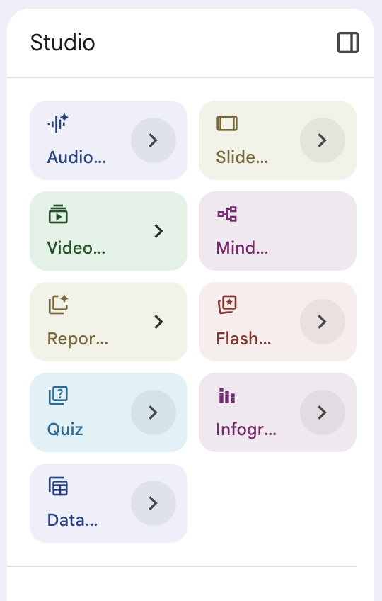
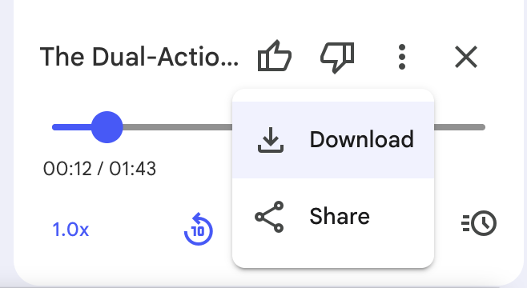
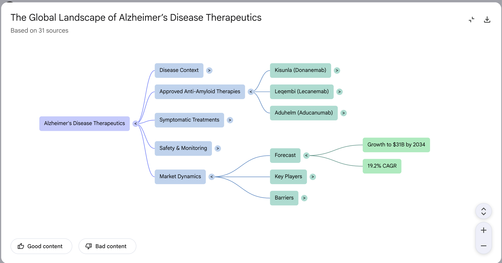

# NotebookLM Studio

## Time Required
30–40 minutes

## Overview
In this lab, you will explore NotebookLM's Studio panel — a set of tools for transforming research into polished, shareable outputs. Starting from the competitive intelligence notebook built in Lab 3, you will generate an Audio Overview, create a structured investor presentation, build a Mind Map, and produce Flashcards and a written Report — each one grounded in your notebook's sources.

### You learn how to:
- Generate an Audio Overview and customize it for a specific audience.
- Create a Presentation with custom instructions.
- Use the Mind Map to visualize source relationships.
- Generate Flashcards and a Report from your research.

## Scenario

<p align="left">
  
</p>

The investor pitch is in two days. Marcus Vance has assembled a strong research notebook — Cymbal's internal financials alongside live competitor and market data. Now he needs to turn that research into outputs his team can use: a briefing for the CEO to listen to on the drive to the meeting, a structured presentation outline, a visual map of the competitive landscape, and a leave-behind report.

In this lab, you will open the notebook from Lab 3 and use the Studio panel to generate all of those outputs.

## Before You Begin

This lab builds on the `CPH-412 Series B Pitch Research` notebook you created in Lab 3. Open that notebook before starting. If you do not have it, create a new notebook with the Cymbal internal financial brief from Lab 3 (copied text) and run at least one web search to add 2–3 competitor sources. The Studio panel works best with at least 3–4 sources loaded.

## Lab Instructions

### Task 1: Generate an Audio Overview

The Audio Overview feature converts your notebook's sources into a conversational podcast-style summary — two AI hosts discussing the key themes, insights, and questions raised by your sources.

1. Open your `CPH-412 Series B Pitch Research` notebook and click the **Studio** tab in the right panel.

   <p align="left">
     
     <br><em>The Studio panel with all output options visible</em>
   </p>

2. In the **Audio Overview** section, click **Customize**. A text field appears where you can guide the conversation's tone and focus.

3. Enter the following customization instruction:

   ```text
   Focus the conversation on the investment case for CPH-412. The audience is the Cymbal CEO preparing for a 30-minute Series B investor meeting. Emphasize the market opportunity, the key competitive differentiators, and the top two investor objections the team should prepare to answer.
   ```

4. Click **Generate** to create the Audio Overview.

   > [!NOTE]
   > Audio generation takes approximately 1–3 minutes. The result is a downloadable audio file featuring two AI hosts. It will reflect the content of all active sources.

5. Play the Audio Overview. As you listen, note:
   - Does it accurately represent Cymbal's competitive position?
   - Does it raise the investor objections you would expect?
   - Is there anything important from the notebook that the hosts did not mention?

6. Click the **download icon** (⬇) to save the audio file.

   <p align="left">
     
     <br><em>The generated Audio Overview with playback and download controls</em>
   </p>

### Task 2: Create a Presentation

The Presentation output generates a structured slide-by-slide outline from your notebook sources, formatted as a presentation that can be opened in Google Slides.

1. In the Studio panel, click **Generate** in the **Presentation** section.

2. When prompted for customization, enter:

   ```text
   Structure this as a Series B investor pitch. Include: (1) Executive Summary, (2) The Alzheimer's Market Opportunity, (3) CPH-412 Mechanism and Differentiation, (4) Competitive Landscape, (5) Financial Summary and Use of Proceeds, (6) Ask and Next Steps. Tone should be confident and data-driven.
   ```

3. Click **Generate**. NotebookLM will produce a slide-by-slide outline.

4. Review the presentation outline. Check that:
   - Each major section maps to a slide
   - Claims are grounded in the notebook sources
   - The competitive positioning section reflects the web sources you added in Lab 3

   <p align="left">
     
     <br><em>The presentation outline generated from notebook sources</em>
   </p>

5. Click **Open in Slides** (if available) to view the formatted output in Google Slides.

   > [!NOTE]
   > The presentation output is an outline and starting structure, not a fully designed deck. It gives you a strong, research-grounded starting point that you then refine in Google Slides.

### Task 3: Build a Mind Map

The Mind Map visualizes the relationships between concepts, sources, and themes across your notebook — useful for spotting connections and gaps that are hard to see in a linear chat interface.

1. In the Studio panel, click **Generate** in the **Mind Map** section.

2. Once the Mind Map loads, explore it:
   - Click on a node to expand it and see related sub-topics.
   - Look for how the competitive landscape nodes (Biogen, Lilly) relate to the market opportunity and CPH-412's positioning.
   - Identify any clusters that surprise you — areas where the sources revealed unexpected connections.

   <p align="left">
     
     <br><em>The Mind Map showing relationships across notebook sources</em>
   </p>

3. Click on the **CPH-412** node (or equivalent). Does the map surface any relationship or sub-topic you had not explicitly asked about in Tasks 1 or 2?

4. Switch back to the **Chat** tab and ask a follow-up question based on what the Mind Map revealed:

   ```text
   The mind map shows a connection between [topic you noticed]. Can you explain how these two areas relate to each other based on the sources?
   ```

### Task 4: Generate Flashcards and a Report

The final two Studio outputs serve different needs: Flashcards for learning and review, and a Report for a polished written summary.

**Flashcards:**

1. In the Studio panel, click **Generate** in the **Flashcards** section.

2. Review the generated cards. They should test key facts such as:
   - CPH-412's mechanism of action
   - The Alzheimer's market size figure
   - Competitor drug names and approval status
   - Cymbal's cash position and burn rate

3. Click through at least 5 cards to verify the accuracy of the answers against your source material.

**Report:**

1. In the Studio panel, click **Generate** in the **Report** section.

2. When prompted for customization, enter:

   ```text
   Write a 3-section briefing report for Cymbal's Board of Directors covering: (1) Market Context, (2) Competitive Positioning, and (3) Investment Readiness. Include specific figures from the sources where available.
   ```

3. Review the generated report. Verify that every statistic in the report can be traced back to a specific source in your notebook.

4. Save the report as a note using the **Save to note** icon (📌).

   <p align="left">
     
     <br><em>The Report with a board-level briefing structure</em>
   </p>

### Bonus Task 5: Customize the Audio Overview for a Different Audience

A single set of sources can produce very different Audio Overviews depending on the audience instruction.

1. Return to the **Audio Overview** section. Click **Customize** again.

2. This time, enter a completely different audience context:

   ```text
   This time, speak to a skeptical venture capital partner who has already seen dozens of biotech pitches. Emphasize the risks — regulatory, competitive, and financial — and what Cymbal would need to prove in Phase 1b to justify a follow-on Series C.
   ```

3. Click **Generate** and listen to the result.

4. Compare this version to the first Audio Overview. Note at least three differences in tone, content, or emphasis between the two.

## Congratulations

In this lab, you have:
- Generated a customized Audio Overview for a specific audience.
- Created a structured investor Presentation from your research sources.
- Visualized source relationships with a Mind Map.
- Generated Flashcards and a written Board Report grounded in notebook sources.
