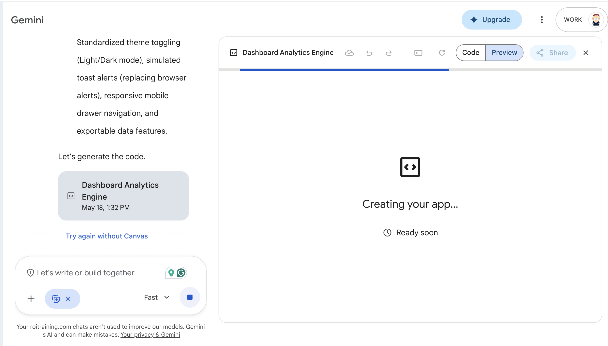
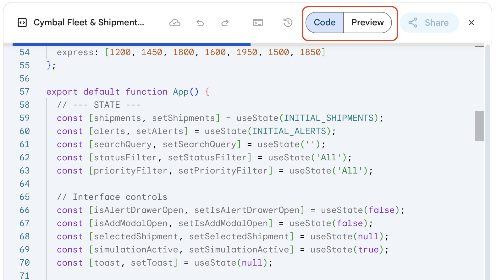
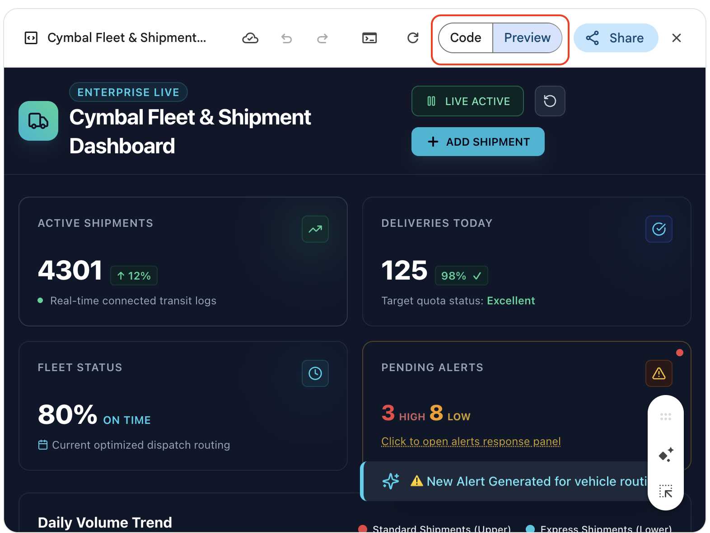
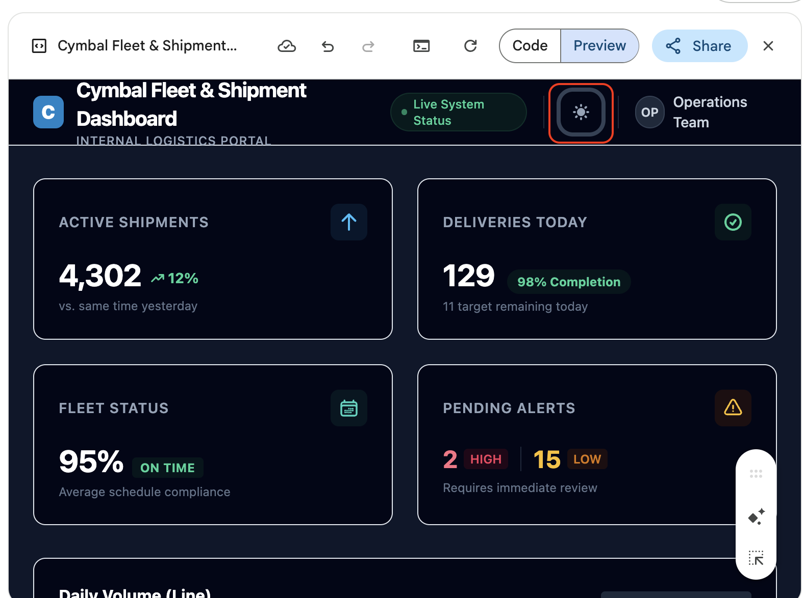

# UX Design from a Napkin Sketch (Image to Code)

## Scenario
Cymbal Logistics is modernizing its back-office operations. The team  needs a Fleet & Shipment Dashboard to help managers quickly assess daily shipment performance. 

This application will empower logistics managers to scan the day’s shipment activity, catch delays or exceptions, and review operational summaries at a glance. 

### Dashboard design
The UI dashboard should include easy-to-read status cards which include the following metrics:
- Active Shipments
- Deliveries today
- Fleet status
- Pending Alerts

Users also want charts which display volume and Fleet Utilization. There should be a grid with active shipments and the ability to add new shipments. 

## Overview
In this lab, you'll use a rough, hand-drawn sketch to generate the first iteration of the Cymbal Fleet & Shipment Dashboard using Gemini Canvas. 

Your objective is to produce a clean, structural dashboard shell. It needs to match the overall layout of the sketch and serve as a solid foundation, perfectly primed for data ingestion in your next lab.

## Time Required
20-30 minutes

## What You Learn
By completing this lab, you learn how to:
- Translate a low-fidelity UI sketch into a structured web layout.
- Prompt Gemini Canvas to generate functional HTML, CSS, and JavaScript from an image.
- Refine and iterate on a generated interface through focused prompting.

## Lab Instructions

### Task 1: Sketch the UI Design

Before writing any code, grab a piece of paper and a pen (or a digital whiteboard) and sketch out your vision for the dashboard based on the scenario. 

1. Review the scenario descrioption above. 

2. Draw a rough wireframe that includes these core structural regions:
   - A header and title area
   - A row of KPI (Key Performance Indicator) cards
   - Two distinct chart placeholders
   - A data table section at the bottom

**Important:** Ignore fine visual details for now. Focus entirely on the structure and layout of the page.


### Task 2: Upload the Sketch and Generate the Initial UI
Now, let's bring the sketch to life in Canvas. 

1. Open [Gemini](https://gemini.google.com/app), and select **Canvas** from the __Tools__ icon. 

2. Take a photo of your sketch and send it to yourself.  Then, paste it into your Gemini prompt window. Alternatively, you can use the example sketch below. Right-click the sketch, copy it, and paste it into your prompt:

   

3. Start small. Try a very brief, basic prompt to see how Gemini interprets the image natively:

```text
Program this dashboard.
```

4. It will take a little while to complete. 

   

5. While it is working you can click on the __Code__ tab of the __Canvas__ and watch the code being generated. 

   

6. When the code completes, click the __Preview__ tab. The should look pretty impressive. 

   


7. OK, you're done! Well, not really. The program doesn't work, it's just simulating a Dashboard. Our prompt was so open-ended the model just made up whatever it needed to to fulfill the task. Let's refine the prompt by narrow it's goal and adding some more instructions. 

8. Click the __New chat__ icon. As before, select __Canvas__ from __Tools__, and then paste the UI sketch. Then, run the prompt below. (_Study the prompt before pasting it._)


```text
You are a senior front-end developer designing an internal logistics dashboard for Cymbal Logistics.

Use the attached sketch to create the first version of the dashboard layout.

Steps:
1. Build a clean, responsive dashboard shell using HTML, CSS, and JavaScript.
2. Match the sketch structure as closely as possible.
3. Include a header, KPI cards, two chart placeholders, and a data table section.
4. Keep the design simple, accessible, and readable.
5. Do not add functional charts or data logic yet.

Output:
- Return only the code needed for the layout.
```

9. Compare the results. It likely looks similar to the first iteration, but there shouldn't be any fake behavior. The code should have also generated quicker since the model was instructed to do less.

10. Take a look at the code. It should be pretty clean CSS and HTML with a little JavaScript. 

7. Let's ask Gemini to make a slight improvement. Ask it to implement a toggle button that allows the user to switch between a Light and Dark theme. Once the prompt runs, examine the results. 

**Checkpoint:** Your generated page should now clearly resemble a logistics dashboard layout, but the functionality is not enabled yet. Your program should be similar to the screenshot below. 

   

### Task 3: Refine and Polish the UI
With the structure established, your final task is to polish the design to make it production-ready. 

1. Ask Gemini to improve the current layout without altering the underlying structure.

2. Focus your prompting purely on usability and aesthetics—do not add new features yet.

3. Guide Gemini to make small, targeted enhancements rather than rewriting the app from scratch. Ask for specific improvements, such as:
   - Better spacing, padding, and layout alignment
   - Cleaner, more professional styling for the KPI cards
   - Stronger, more legible typography for section labels
   - Improved readability in the table formatting
   - Overall visual consistency across the entire dashboard

Use a refinement prompt similar to this:

```text
Refine the dashboard styling while keeping the exact same overall layout.

Improve the following:
- Spacing and alignment
- Typography and visual hierarchy
- KPI card styling
- Data table readability
- Visual consistency across the page
- Highlight cards when the user hovers over them

Do not add chart libraries, CSV parsing, or backend logic.
Keep this as a front-end dashboard shell that is perfectly prepared for data integration.
```

4. Complete one focused iteration pass based on this prompt.

5. Verify that your final UI still faithfully matches the initial sketch while looking considerably cleaner.

**Checkpoint:** You should now have a polished, responsive dashboard shell. Remember, it should not yet be a fully featured or data-driven application!

## Congratulations
In this lab, you have:
- Translated a low-fidelity UI sketch into a structured web layout.
- Prompted Gemini Canvas to generate functional HTML, CSS, and JavaScript from an image.
- Refined and iterated on a generated interface through focused prompting.